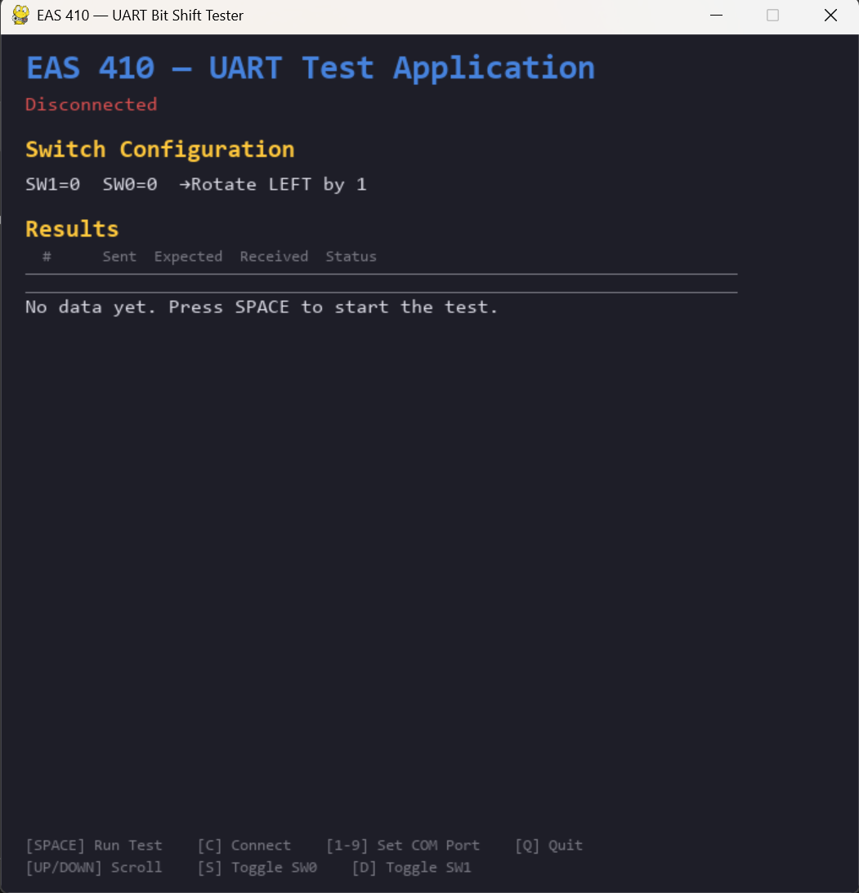

# EAS 410 - Practical 1

This repository contains the deliverables for Practical 1 of the EAS 410 module (Serial Communication and Computer Memory).

The project is divided into two primary tasks:
- **Task A**: Implementation of a Universal Asynchronous Receiver/Transmitter (UART) on a DE0-Nano-SoC FPGA for bidirectional communication, along with a PC application to control and display a circular bit-shift operation.
- **Task B**: Documentation and design of an 8-bit, 256-byte RAM configuration using 8x8x1 memory chips.

## PC Application



## Folder Structure

```
c:\source\lab1\
│
├── README.md               # You are here - Project overview and checklist
├── assets/                 # Screenshots and images
├── docs/                   # Provided specifications and guides
├── frontend/               # PC Application (Python / PyGame GUI) for UART communication
├── db/                     # Quartus generated database files
├── incremental_db/         # Quartus generated incremental compilation files
├── output_files/           # Quartus output programming files (SOF, POF)
├── simulation/             # Simulation files for the FPGA designs
│
└── *.vhd / *.qpf / *.qsf   # VHDL source code and Quartus project files for the FPGA
```

## Work Breakdown & Deliverables

### Task A (UART & FPGA Hardware Integration)
- [ ] Implement VHDL/Verilog UART module on the FPGA (Target Baud: 115200, 8N1, No parity, No flow control)
- [ ] Implement Circular Bit Shifter controlled by `SW0` and `SW1`
- [ ] Integrate UART with the Shifter logic (Receive -> Shift -> Transmit)
- [ ] Write Functional Simulation for UART modules
- [ ] Design and implement PC GUI application in Python (PyGame / CustomTkinter) within `frontend/`
- [ ] Generate sequence of 50 random bytes from the PC and send to the FPGA
- [ ] Display expected outcome, actual received byte, and any calculation errors
- [ ] Display approximate baud rate

### Task B (Memory Design)
- [ ] Design an 8-bit, 256-byte RAM using 8x8x1 bit memory chips
- [ ] Support nibble (4-bit) and word (8-bit) memory access
- [ ] Draft an architectural block diagram for the RAM

### Documentation & Submission
- [ ] Compile a "Summary of Findings" document containing design explanations, diagrams, and VHDL snippets
- [ ] Add flow diagrams / pseudo code for the PC application
- [ ] Zip up code according to the assignment requirement (`EAS410_P1_Groupnumber.zip`) for upload on AMS
